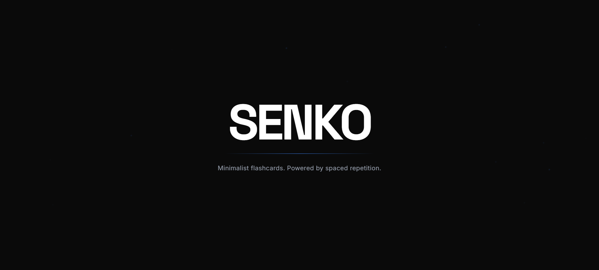
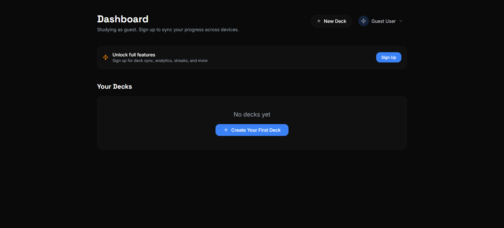
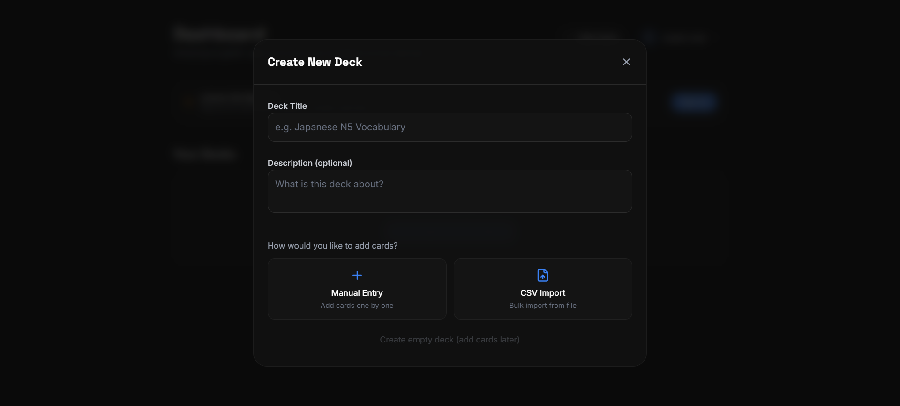
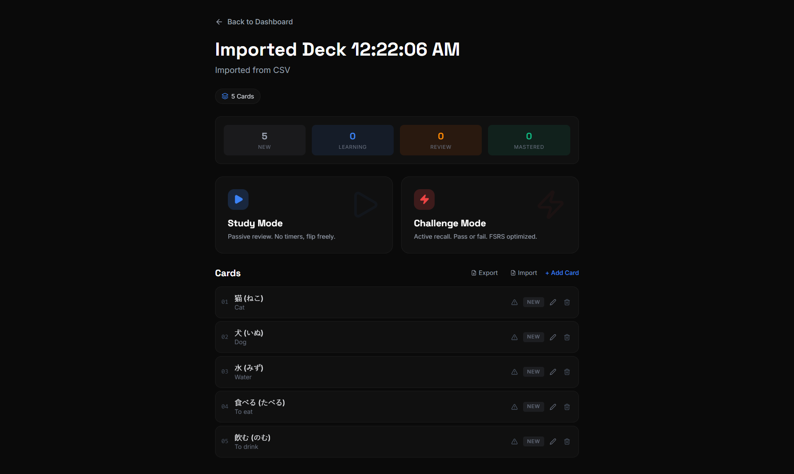

<div align="center">

# ⚡ SENKO

### Minimalist flashcards. Powered by spaced repetition.

A tool for everyone — a convenient study power-tool.

</div>

---

## 📸 Screenshots

| | |
|:---:|:---:|
|  |  |
|  |  |

---

## 📖 Overview

Senko is a minimalist flashcard application designed to make studying effortless and effective. Built around the principles of spaced repetition, it helps you retain information long-term by surfacing cards right before you're about to forget them.

Whether you're studying languages, medicine, law, or any subject, Senko adapts to your learning pace. Simply mark cards as **Pass** or **Fail**, and the built-in FSRS algorithm handles the rest — automatically scheduling reviews at optimal intervals.

**Key highlights:**
- **Zero friction** — Clean UI with no distractions, focus purely on learning
- **Guest mode** — Try the full app without creating an account
- **Smart scheduling** — FSRS algorithm personalizes review intervals per card
- **Progress tracking** — Visual heatmap, streaks, and accuracy metrics keep you motivated
- **Multilingual** — Full UTF-8 support for studying in any language

---

## ✨ Features

### 🧠 Spaced Repetition
- **Pass/Fail binary system** — no complex grading, just simple decisions
- **FSRS-powered scheduling** — cards adapt to your memory strength
- **Three learning states** — Learning → Review → Mastered

### 📚 Deck Management
- Create decks manually, card by card
- **CSV import** with auto-detection of front/back columns
- **CSV export** with full UTF-8 multilingual support (CJK, Arabic, etc.)
- Drag & drop CSV files directly onto decks
- Edit, delete, and organize cards freely

### 🎯 Study Modes
- **Study Mode** — Passive review, flip freely, no timers
- **Challenge Mode** — Active recall with a 60-second circular timer (green → yellow → red)

### 📊 Dashboard Analytics
- **Studied Today** — Cards reviewed in today's sessions
- **Total Learned** — Cards mastered across all decks
- **Accuracy** — Overall pass rate
- **Streak** — Consecutive days of studying
- **Retention breakdown** — Mastered / Learning / Review with percentages

### 🟦 Activity Heatmap
- Anki-style monthly calendar
- **Blue intensity scale** — brighter cells = more cards studied
- Navigate between months with arrow controls

### 🔐 Authentication
- **Supabase Auth** — email/password sign in & sign up
- **Guest Mode** — full app access without an account
- **Guest → Account migration** — sign up anytime to sync your decks
- Deck sync across devices for authenticated users

---

## 🛠️ Tech Stack

| Layer | Technology |
|---|---|
| **Frontend** | React 19 + TypeScript + Vite |
| **Styling** | Tailwind CSS v4 |
| **Animations** | Framer Motion |
| **Icons** | Lucide React |
| **Backend** | Supabase (Auth + Database) |

---

## 🚀 Getting Started

### Prerequisites
- Node.js 18+
- A Supabase project (for authentication & sync)

### Installation

```bash
# Clone the repository
git clone https://github.com/rEifun30/Kosoku-Prototype.git
cd Kosoku-Prototype

# Install dependencies
npm install

# Set up environment variables
cp .env.example .env
# Edit .env with your Supabase credentials
```

### Running Locally

```bash
npm run dev
```

Open [http://localhost:3000](http://localhost:3000) in your browser.

### Building for Production

```bash
npm run build
npm run preview
```

---

## 📁 Project Structure

```
src/
├── components/
│   ├── AuthForm.tsx       # Sign in / Sign up / Guest
│   ├── ChallengeMode.tsx  # Active recall with circular timer
│   ├── CreateDeck.tsx     # Deck creation modal
│   ├── Dashboard.tsx      # Main dashboard with stats & heatmap
│   ├── DeckView.tsx       # Individual deck view with Study/Challenge
│   ├── DropZone.tsx       # Drag & drop CSV import
│   ├── Heatmap.tsx        # Monthly activity heatmap
│   ├── Intro.tsx          # Animated intro screen
│   ├── StudyMode.tsx      # Passive flashcard review
│   └── UserProfile.tsx    # Account dropdown
├── contexts/
│   ├── AuthContext.tsx          # Supabase auth state
│   ├── DeckContext.tsx          # Deck/card management
│   └── StudyActivityContext.tsx # Streak & heatmap tracking
└── utils/
    ├── fsrs.ts            # FSRS scheduling logic
    └── supabase.ts        # Supabase client
```

---

## 📦 Database Setup

Run the migration SQL in your Supabase SQL Editor:

```sql
-- See migrations/v3_struggling_and_updated_at.sql
```

### Required Tables
- `profiles` — User profiles (auto-created on sign up)
- `decks` — Deck metadata
- `cards` — Individual flashcards with FSRS fields
- `study_streaks` — Daily streak tracking
- `reviews` — Review history for analytics

---

## 🌍 Multilingual Support

Senko fully supports:
- **UTF-8 encoding** for all text
- **Japanese, Korean, Chinese** (Simplified & Traditional)
- **Arabic** (RTL-safe storage)
- **Spanish, Filipino**, and any other language

CSV import/export preserves all characters exactly as written — no transliteration or normalization.

---

## 📄 License

MIT

---

> *"The best learning system is the one you don't have to think about using."*
